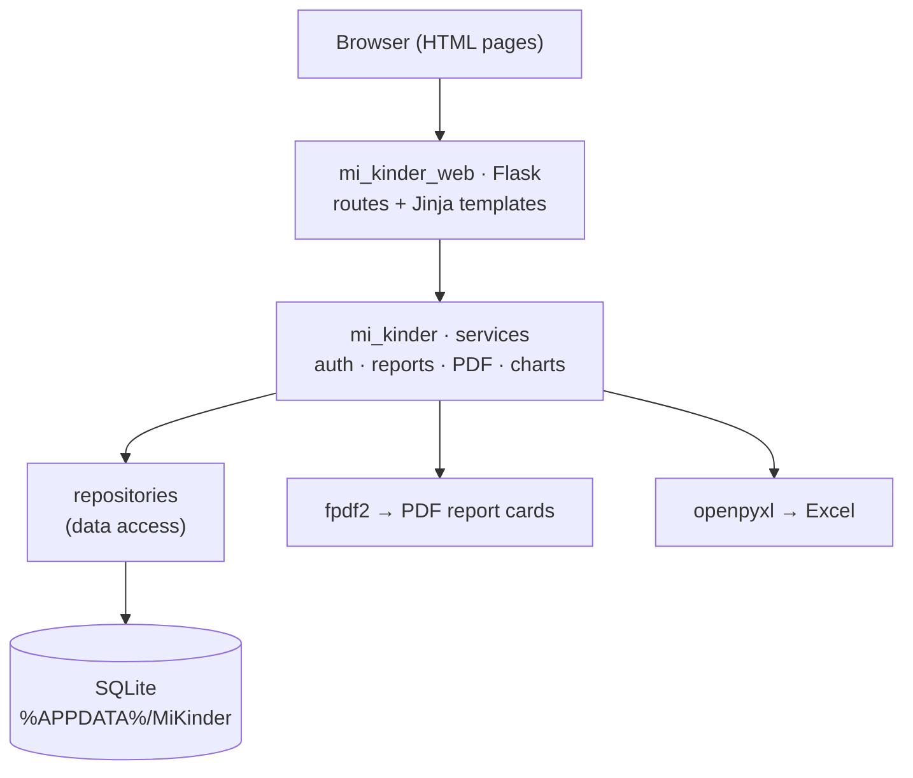

[Español](README.md) · **English**

# Mi Kinder — School management system (Colegio CAPI)


-C2321F)

A web application for running the day-to-day of a **kindergarten**. The principal and
teachers sign in with a username and password to manage classes, students, attendance,
and assessments — and, the headline feature, to **generate PDF report cards**.

The whole interface is made of **web pages** that open in the browser, and the data
lives in a local database on the machine. That means it runs offline, with no external
services to depend on.

## Screenshots

| Sign in | Dashboard |
| --- | --- |
|  |  |

| Students | Report card (headline feature) |
| --- | --- |
|  |  |

| Assessments | Users and roles |
| --- | --- |
|  |  |

| Reports / Report cards | Charts |
| --- | --- |
|  |  |

| Class report (ranking) | Report card exported to **PDF** |
| --- | --- |
|  |  |

> The last image is the **actual PDF downloaded** from the system (with the teacher's and
> principal's signatures), not a mockup.

> The screenshots use **fictional demo data**. The real system never exposes student
> information in this repository — the database lives outside the project (see
> *Privacy*).

## Roles and permissions

| Capability | Principal | Teacher |
| --- | :---: | :---: |
| School-wide dashboard | ✅ | ✅ (own class) |
| See **all** classes and students | ✅ | Assigned classes only |
| Add/edit students | ✅ | ✅ |
| Take attendance | ✅ | ✅ |
| Enter assessments | ✅ | ✅ |
| Generate report cards and reports | ✅ | ✅ |
| **User management** (create teachers) | ✅ | ❌ |
| School and school-year **settings** | ✅ | ❌ |

## Features

- **Role-based authentication** (principal / teacher) with passwords hashed using
  **bcrypt** and server-side sessions; a teacher only sees the classes assigned to her.
- **School years and terms**: each year (e.g. 2025-2026) has its three terms, and the
  system always operates on the active year and term.
- **Classes and students**: enrollment with student and guardian details, photo, grade
  level, and student transfers between classes with a history trail.
- **Daily attendance** per class (present / absent / late / excused).
- **Assessment by area** (Language, Mathematical Thinking, etc.) on a configurable
  **achievement scale** (Achieved / In Progress / Needs Support), per student and term.
- **Report cards and reports** — the core feature:
  - **Individual report card**: school header, student details, and an areas × terms
    matrix showing achievement level; it renders on screen and **downloads as a PDF**
    (generated with **fpdf2**).
  - **Class report**: class averages and *ranking*, also exportable to PDF.
  - Student list export to **Excel** (openpyxl).
- **Performance charts** by level/area and attendance charts (matplotlib).
- **Social-emotional tracking** and per-student notes.
- **User management** (principal only) and school **settings**.

## Architecture



Layered separation: **web** (Flask + templates) → **services** (business logic:
authentication, reports, PDF/chart generation) → **repositories** (queries) →
**database** (SQLite with a schema versioned by migrations).

## Project structure

```
run_web.py              # starts the server (http://localhost:5000)
mi_kinder/              # domain core
  ├── database/         # schema, migrations, seed, connection
  ├── models/           # entities (student, class, assessment, school year…)
  ├── repositories/     # data access
  └── services/         # auth, reports, PDF, charts, session
mi_kinder_web/          # web layer
  ├── app.py            # Flask app factory
  ├── routes/           # login, dashboard, classes, students, assessments,
  │                     #   attendance, reports, charts, users, settings…
  ├── templates/        # HTML pages (Jinja)
  └── static/           # CSS and JS
docs/                   # screenshots for this README
```

## Setup and usage

```bash
pip install -r requirements-web.txt
python run_web.py
# Open http://localhost:5000
```

On first run the system creates the database and a **default principal account** so you
can sign in:

```
Username:  directora
Password:  admin123
```

> Change this password from *Users* before any real use.

The database, photos, and backups are stored in `%APPDATA%/MiKinder/` (outside this
project).

## Privacy

This repository contains **only the code**. The database with student information lives
outside the project (`%APPDATA%/MiKinder/`) and is excluded via `.gitignore`; it is never
committed. The screenshots in this README use fictional demo data.

## Stack

Python · Flask 3 · SQLite (sqlite3) · bcrypt · fpdf2 (PDF) · openpyxl (Excel) ·
matplotlib (charts) · Pillow · Jinja2 · HTML/CSS/JS.

## License

Code released under the [MIT](LICENSE) license. "Colegio CAPI" is used as project
context; the screenshots use fictional demo data (see *Privacy*).

---
**Ángel Josué García Cantero** · [github.com/AngelJGC](https://github.com/AngelJGC)
