# Mi Kinder — Sistema de gestión escolar (Colegio CAPI)


-C2321F)

Aplicación web para la **gestión escolar de un jardín de niños**: la directora y las
maestras entran con su usuario y contraseña y administran grupos, alumnos, asistencia,
evaluaciones y — la función estrella — la **generación de boletas de evaluación en PDF**.

Toda la interfaz son **páginas web** que se abren en el navegador; los datos viven en
una base local en el equipo, así que funciona sin internet y sin depender de servicios
externos.

## Capturas

| Inicio de sesión | Panel principal |
| --- | --- |
| 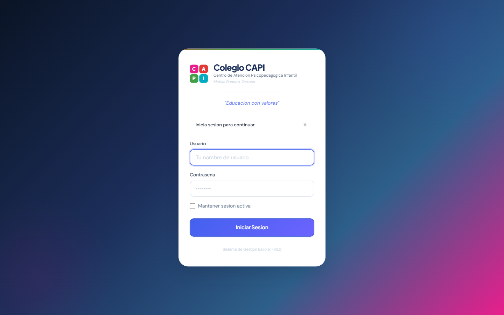 | 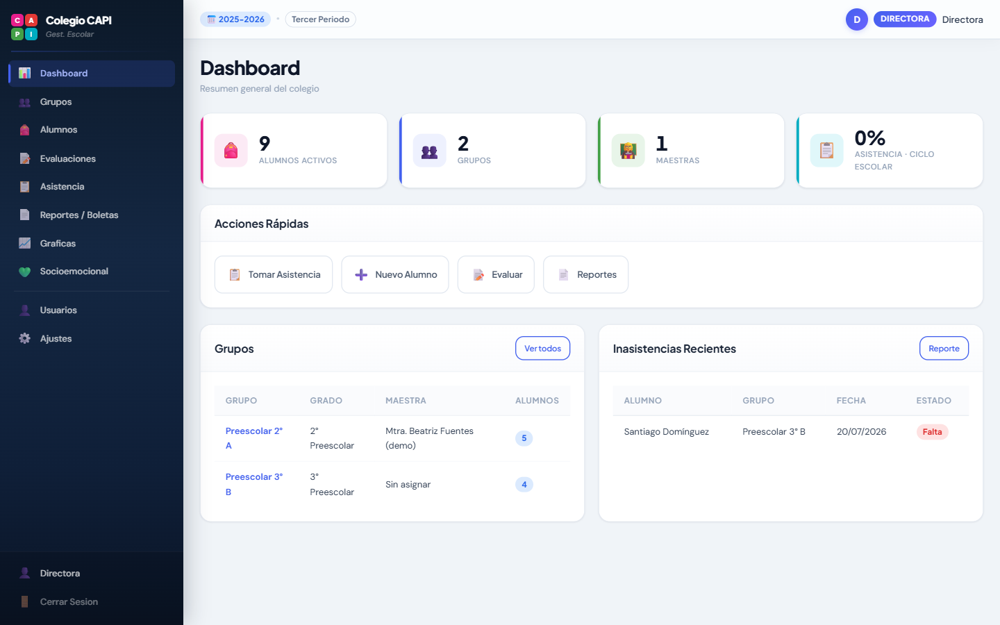 |

| Alumnos | Boleta de evaluación (función estrella) |
| --- | --- |
| 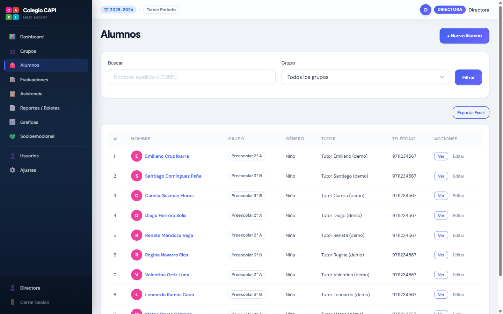 | 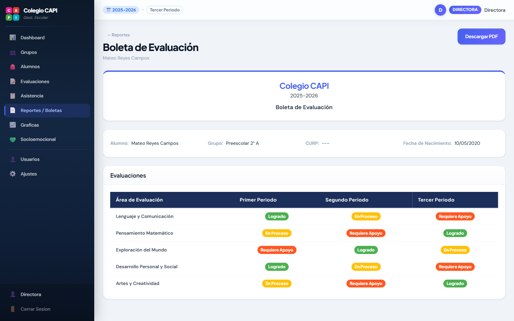 |

| Evaluaciones | Usuarios y roles |
| --- | --- |
| 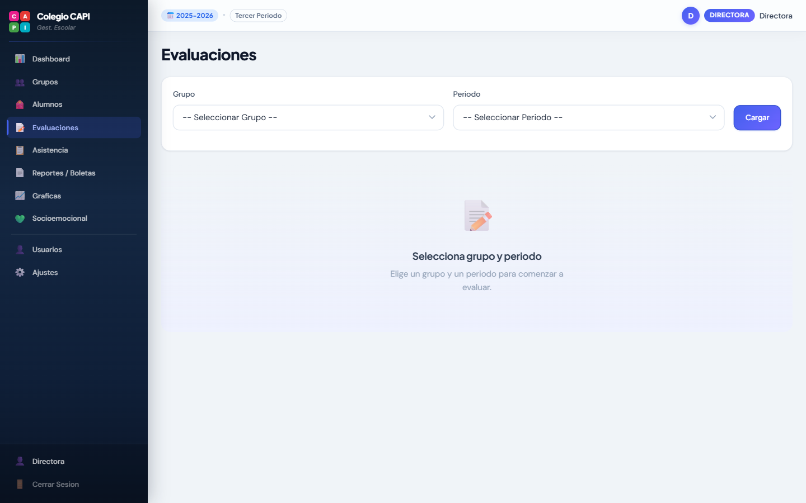 | 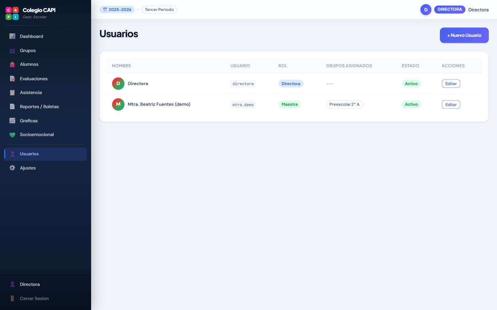 |

| Reportes / Boletas | Gráficas |
| --- | --- |
| 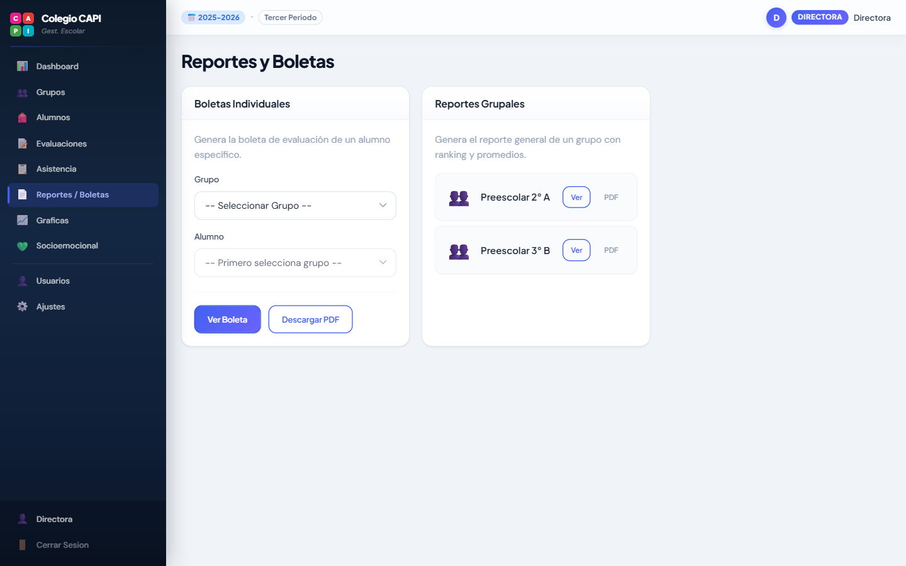 | 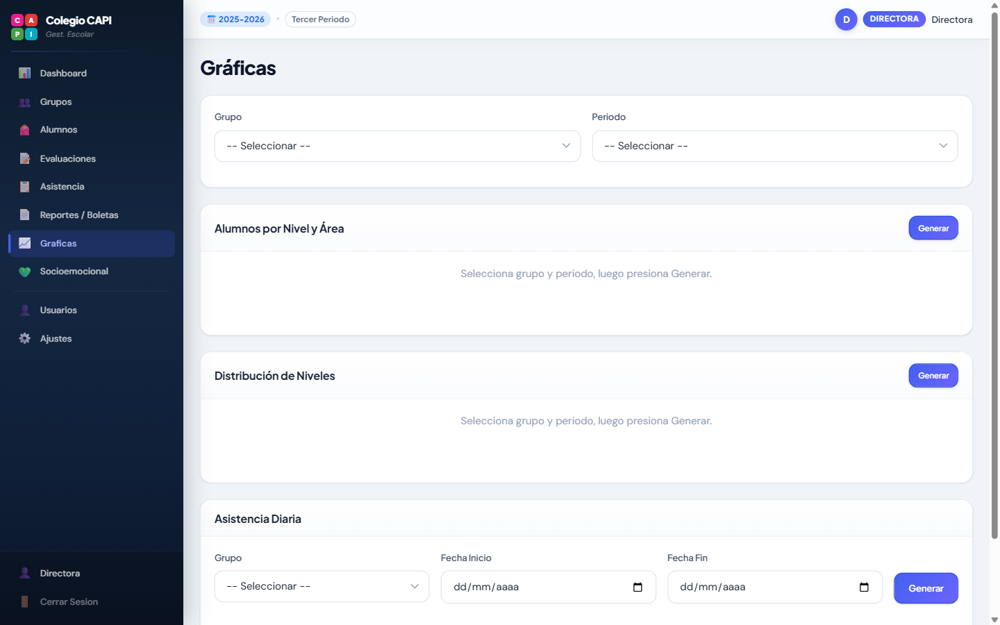 |

| Reporte grupal (ranking) | Boleta generada en **PDF** |
| --- | --- |
| 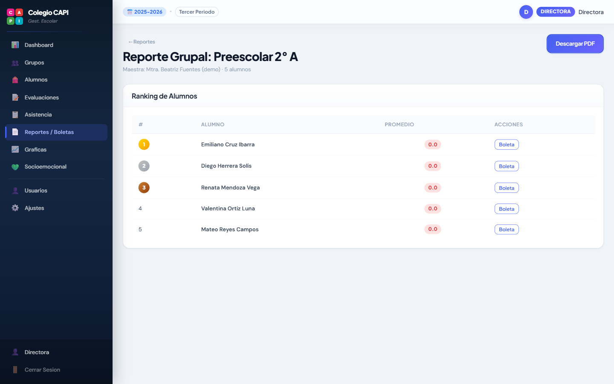 | 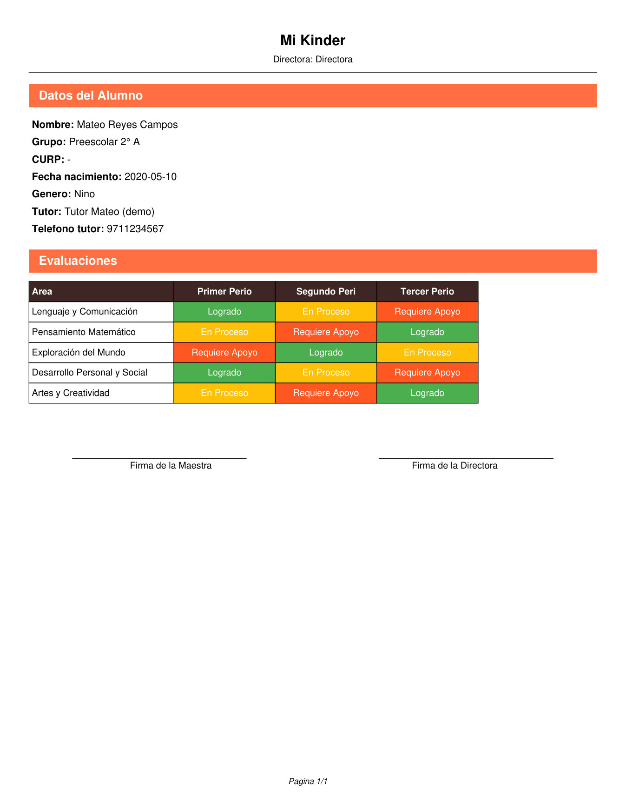 |

> La última imagen es el **PDF real descargado** desde el sistema (con las firmas de
> maestra y directora), no una maqueta.

> Las capturas se tomaron con **datos ficticios de demostración**. El sistema real
> nunca expone información de alumnos en este repositorio (la base de datos vive fuera
> del proyecto, ver *Privacidad*).

## Roles y permisos

| Capacidad | Directora | Maestra |
| --- | :---: | :---: |
| Panel general del colegio | ✅ | ✅ (su grupo) |
| Ver **todos** los grupos y alumnos | ✅ | Solo grupos asignados |
| Alta/edición de alumnos | ✅ | ✅ |
| Tomar asistencia | ✅ | ✅ |
| Capturar evaluaciones | ✅ | ✅ |
| Generar boletas y reportes | ✅ | ✅ |
| **Gestión de usuarios** (crear maestras) | ✅ | ❌ |
| **Ajustes** del colegio y ciclo escolar | ✅ | ❌ |

## Funcionalidad

- **Autenticación por roles** (directora / maestra) con contraseñas cifradas con
  **bcrypt** y sesiones de servidor; una maestra solo ve los grupos que le fueron
  asignados.
- **Ciclos escolares y periodos**: cada ciclo (p. ej. 2025-2026) con sus tres periodos;
  el sistema trabaja siempre sobre el ciclo y periodo activos.
- **Grupos y alumnos**: alta con datos del alumno y del tutor, foto, grado, y traspaso
  de alumnos entre grupos con historial.
- **Asistencia** diaria por grupo (presente / ausente / retardo / justificada).
- **Evaluación por áreas** (Lenguaje, Pensamiento Matemático, etc.) con una **escala de
  logro** configurable (Logrado / En Proceso / Requiere Apoyo), por alumno y periodo.
- **Boletas y reportes** ⭐ — la función central:
  - **Boleta individual**: encabezado del colegio, datos del alumno y matriz de áreas ×
    periodos con el nivel de logro; se visualiza en pantalla y se **descarga en PDF**
    (generado con **fpdf2**).
  - **Reporte grupal**: promedios y *ranking* del grupo, también exportable a PDF.
  - Exportación de listas de alumnos a **Excel** (openpyxl).
- **Gráficas** de desempeño por nivel/área y de asistencia (matplotlib).
- **Seguimiento socioemocional** y observaciones por alumno.
- **Gestión de usuarios** (solo directora) y **ajustes** del colegio.

## Arquitectura

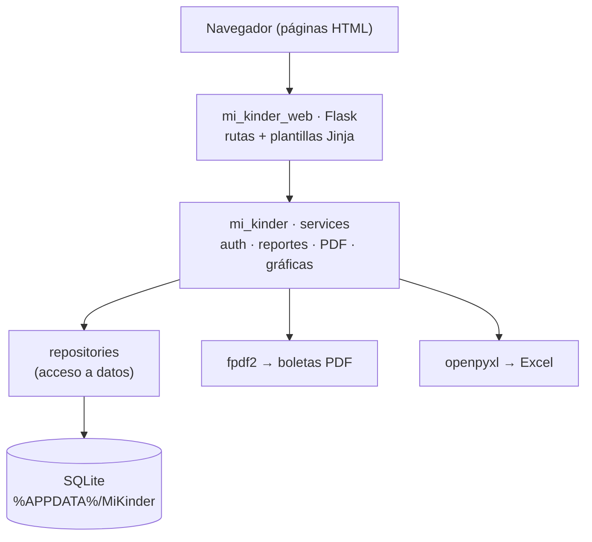

Separación por capas: **web** (Flask + plantillas) → **servicios** (lógica de negocio:
autenticación, reportes, generación de PDF/gráficas) → **repositorios** (consultas) →
**base de datos** (SQLite con esquema versionado por migraciones).

## Estructura

```
run_web.py              # arranca el servidor (http://localhost:5000)
mi_kinder/              # núcleo de dominio
  ├── database/         # esquema, migraciones, seed, conexión
  ├── models/           # entidades (alumno, grupo, evaluación, ciclo…)
  ├── repositories/     # acceso a datos
  └── services/         # auth, reportes, PDF, gráficas, sesión
mi_kinder_web/          # capa web
  ├── app.py            # creación de la app Flask
  ├── routes/           # login, dashboard, grupos, alumnos, evaluaciones,
  │                     #   asistencia, reportes, gráficas, usuarios, ajustes…
  ├── templates/        # páginas HTML (Jinja)
  └── static/           # CSS y JS
docs/                   # capturas para este README
```

## Instalación y uso

```bash
pip install -r requirements-web.txt
python run_web.py
# Abre http://localhost:5000
```

Al primer arranque el sistema crea la base de datos y una **cuenta de directora por
defecto** para poder entrar:

```
Usuario:     directora
Contraseña:  admin123
```

> Cambia esta contraseña desde *Usuarios* antes de un uso real.

La base de datos, las fotos y los respaldos se guardan en
`%APPDATA%/MiKinder/` (fuera de este proyecto).

## Privacidad

Este repositorio contiene **solo el código**. La base de datos con información de
alumnos vive fuera del proyecto (`%APPDATA%/MiKinder/`) y está excluida por
`.gitignore`; nunca se sube al repositorio. Las capturas de este README usan datos
ficticios de demostración.

## Stack

Python · Flask 3 · SQLite (sqlite3) · bcrypt · fpdf2 (PDF) · openpyxl (Excel) ·
matplotlib (gráficas) · Pillow · Jinja2 · HTML/CSS/JS.

---
**Ángel Josué García Cantero** · [github.com/AngelJGC](https://github.com/AngelJGC)
